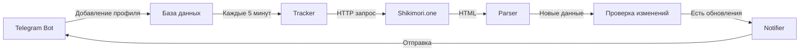

<div align="center">

# 👀 Shikimori Tracker Bot


_Telegram-бот для отслеживания активности друзей на Shikimori.one_

[](https://www.python.org/downloads/)
[](https://docs.aiogram.dev/)
[](https://opensource.org/licenses/MIT)
[](https://github.com/psf/black)

[Возможности](#-возможности) • [Установка](#-быстрый-старт) • [Использование](#-использование) • [Технологии](#️-технологии)

</div>

---

## ⚠️ Важное примечание

> **Этот проект создан исключительно в развлекательных и образовательных целях!**
>
> Бот предназначен для отслеживания активности **ваших друзей с их ведома**, чтобы:
>
> - 🎬 Узнавать, что они смотрят, и обсуждать аниме
> - 🎮 Находить общие интересы
> - 📊 Делиться рекомендациями
>
> **НЕ используйте** для:
>
> - ❌ Скрытого наблюдения за людьми
> - ❌ Преследования или слежки
> - ❌ Нарушения приватности
>
> Всегда **спрашивайте разрешение** перед добавлением чьего-либо профиля!

---

## 🎯 Возможности

- ✅ **Отслеживание истории** — мгновенные уведомления о новых просмотрах аниме
- 🟢 **Статус онлайн** — узнавайте, когда друзья заходят на Shikimori
- ⚙️ **Гибкие настройки** — настраивайте уведомления для каждого профиля отдельно
- 📊 **Проверка статуса** — смотрите текущую активность в любой момент
- 🔄 **Автоматика** — бот сам проверяет обновления каждые 5 минут
- 💾 **Локальная база** — все данные хранятся у вас, никуда не передаются

## 📋 Требования

- Python 3.10 или выше
- Токен Telegram бота от [@BotFather](https://t.me/BotFather)
- Доступ к интернету
- ~50-100 МБ свободной памяти

## 🚀 Быстрый старт

### 1️⃣ Клонирование репозитория

```bash
git clone https://github.com/yourusername/shikimori-tracker-bot.git
cd shikimori-tracker-bot
```

### 2️⃣ Установка зависимостей

```bash
# Создание виртуального окружения
python -m venv venv

# Активация
# Windows:
venv\Scripts\activate
# Linux/MacOS:
source venv/bin/activate

# Установка пакетов
pip install -r requirements.txt
```

### 3️⃣ Настройка

Создайте файл `.env` в корневой директории:

```env
BOT_TOKEN=your_bot_token_here
DATABASE_URL=sqlite+aiosqlite:///./shikimori_bot.db
CHECK_INTERVAL=5
ONLINE_CHECK_INTERVAL=2
```

### 4️⃣ Запуск

```bash
python bot.py
```

Готово! Бот запущен и работает 🎉

## 📱 Использование

### Основные команды

| Команда  | Описание                 |
| -------- | ------------------------ |
| `/start` | Главное меню             |
| `/help`  | Справка по использованию |

### Пример работы

1. **Добавьте профиль друга**

   ```
   /start → Добавить профиль → Bubassaka
   ```

2. **Настройте уведомления**

   ```
   Мои профили → Выберите профиль → Настройки
   ```

   - 📺 История просмотров
   - 🟢 Вход в сеть
   - ⚫ Выход из сети

3. **Получайте уведомления**

   ```
   🔔 Новая активность Bubassaka

   📺 Naruto: Shippuuden
      Просмотрено 483 серия
      ⏰ 5 минут назад
   ```

## 🗂 Структура проекта

```
shikimori_tracker_bot/
├── 📄 bot.py                    # Точка входа
├── ⚙️ config.py                 # Конфигурация
├── 📦 requirements.txt          # Зависимости
│
├── 🗄 database/
│   ├── models.py               # Модели SQLAlchemy
│   └── database.py             # Работа с БД
│
├── 🎮 handlers/
│   ├── start.py                # /start, /help
│   ├── profile.py              # Управление профилями
│   └── settings.py             # Настройки уведомлений
│
├── ⌨️ keyboards/
│   ├── inline.py               # Inline-клавиатуры
│   └── reply.py                # Reply-клавиатуры
│
├── 🔧 services/
│   ├── shikimori_parser.py     # Парсинг Shikimori
│   ├── tracker.py              # Отслеживание изменений
│   └── notifier.py             # Отправка уведомлений
│
└── 🛠 utils/
    └── helpers.py              # Вспомогательные функции
```

## ⚙️ Технологии

<table>
<tr>
<td>

**Backend**

- [aiogram 3.x](https://docs.aiogram.dev/) — Telegram Bot API
- [SQLAlchemy 2.0](https://www.sqlalchemy.org/) — ORM
- [aiosqlite](https://pypi.org/project/aiosqlite/) — Async SQLite

</td>
<td>

**Парсинг**

- [aiohttp](https://docs.aiohttp.org/) — HTTP клиент
- [BeautifulSoup4](https://www.crummy.com/software/BeautifulSoup/) — HTML парсер
- [APScheduler](https://apscheduler.readthedocs.io/) — Планировщик

</td>
</tr>
</table>

## 🔧 Как это работает



1. **Парсинг** — получаем HTML страницы профиля с Shikimori
2. **Сравнение** — ищем новые записи в истории
3. **Уведомление** — отправляем красиво оформленное сообщение

## 📊 База данных

SQLite с четырьмя таблицами:

| Таблица            | Описание                |
| ------------------ | ----------------------- |
| `users`            | Пользователи Telegram   |
| `tracked_profiles` | Отслеживаемые профили   |
| `history_entries`  | История просмотров      |
| `online_status`    | История онлайн-статусов |

## 🔐 Безопасность и приватность

✅ **Локальное хранение** — вся база данных у вас на компьютере  
✅ **Никаких серверов** — данные не отправляются третьим лицам  
✅ **Открытый код** — можете проверить каждую строку  
✅ **Простое удаление** — удалите `.env` и `shikimori_bot.db`

## 🐛 Решение проблем

<details>
<summary><b>Ошибка "Invalid token"</b></summary>

Проверьте правильность токена в `.env`:

```env
BOT_TOKEN=123456789:ABCdefGHIjklMNOpqrsTUVwxyz
```

</details>

<details>
<summary><b>Профиль не найден</b></summary>

- Проверьте написание никнейма
- Убедитесь, что профиль публичный
- Попробуйте открыть профиль в браузере
</details>

<details>
<summary><b>Не приходят уведомления</b></summary>

1. Проверьте, что бот запущен (`python bot.py`)
2. Включите уведомления в настройках профиля
3. Проверьте логи в `bot.log`
</details>

Больше ответов в [документации](https://github.com/yourusername/shikimori-tracker-bot/issues)

## 📝 Логирование

Все события записываются в:

- 🖥 **Консоль** — для наблюдения в реальном времени
- 📄 **bot.log** — для анализа ошибок

```bash
# Просмотр последних логов
tail -f bot.log
```

## 🤝 Вклад в проект

Буду рад любому вкладу!

1. Fork репозитория
2. Создайте ветку (`git checkout -b feature/amazing-feature`)
3. Commit изменения (`git commit -m 'Add amazing feature'`)
4. Push в ветку (`git push origin feature/amazing-feature`)
5. Откройте Pull Request

## 📄 Лицензия

Проект распространяется под лицензией MIT. См. файл [LICENSE](LICENSE) для подробностей.

## 👨‍💻 Автор

Создано с ❤️ для сообщества любителей аниме

## ⭐ Поддержка

Если проект оказался полезным, поставьте звездочку ⭐

---

<div align="center">

**[⬆ Вернуться к началу](#-shikimori-tracker-bot)**

Made with 🍜 and ☕

</div>
